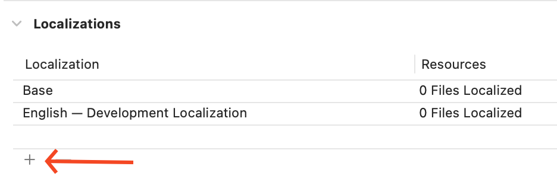
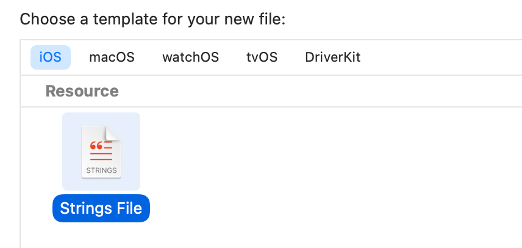
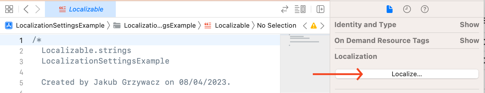

# @skippay/capacitor-localization-settings

Capacitor module to expose per-app language preferences API on iOS and Android.

Capacitor v5

## Install

```bash
npm install @skippay/capacitor-localization-settings
npx cap sync
```

## API

<docgen-index>

* [`getLanguage()`](#getlanguage)
* [`setLanguage(...)`](#setlanguage)

</docgen-index>

<docgen-api>
<!--Update the source file JSDoc comments and rerun docgen to update the docs below-->

### getLanguage()

```typescript
getLanguage() => Promise<{ value: string; }>
```

**Returns:** <code>Promise&lt;{ value: string; }&gt;</code>

--------------------


### setLanguage(...)

```typescript
setLanguage(options: { value: string; }) => Promise<{ value: string; }>
```

| Param         | Type                            |
| ------------- | ------------------------------- |
| **`options`** | <code>{ value: string; }</code> |

**Returns:** <code>Promise&lt;{ value: string; }&gt;</code>

--------------------

</docgen-api>


## Define supported languages

To get started, you'll need to define the languages that your app supports.

### iOS

Open your project in XCode, in Project Navigator select project, go to `Info` tab, and
under `Localizations` section add languages you want to support.



Next, you need to create a `Localization.strings` file.



Select newly created file and on the right side of the screen, under `Localizations` selection press `Localize`. Confirm
the popup.



Lastly, you need to select all elements in the section form previous step.

### Android

Create new file in `android/app/src/main/res/xml` directory named `locales_config.xml`. and define supported languages:

```xml
<?xml version="1.0" encoding="utf-8"?>
<locale-config xmlns:android="http://schemas.android.com/apk/res/android">
  <locale android:name="en"/>
  <locale android:name="pl"/>
  <locale android:name="fr"/>
</locale-config>
```

Then, open `android/app/src/main/AndroidManifest.xml` and add following line to the Application tag:

```xml
<application
        android:name=".MainApplication"
        android:localeConfig="@xml/locales_config" <!-- this line -->
>
```

## Inspiration

This plugin is heavily inspired by [react-native-localization-settings](https://github.com/jakex7/react-native-localization-settings/) plugin.
